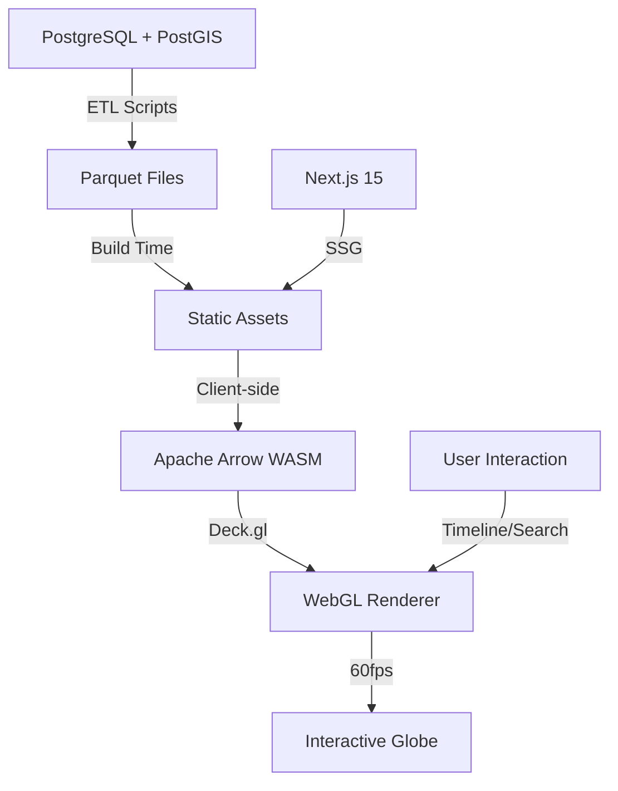

# BibleMap Φ

**Interactive 3D WebGL visualization of 2,900+ biblical events on a high-performance globe**

[](https://biblemap-phi.vercel.app)
[](https://nextjs.org/)
[](https://www.typescriptlang.org/)
[](https://opensource.org/licenses/MIT)


## Overview

BibleMap Φ is a high-performance, interactive 3D visualization that maps over 2,900 biblical events onto a WebGL-powered globe. Built for researchers, educators, and anyone interested in exploring biblical history through an immersive, data-driven lens.

The application renders thousands of geospatial data points at 60fps using client-side WebGL acceleration, with a cinematic timeline spanning from 4004 BC to 100 AD.

## ✨ Key Features

- **🗺️ Interactive 3D Globe** - Explore 2,900+ biblical events with smooth WebGL rendering
- **⏱️ Cinematic Timeline** - Scrub through 4,000+ years of history (4004 BC → 100 AD)
- **🔍 Real-time Search** - Instant filtering and search across all events
- **📱 Fully Responsive** - Optimized for desktop, tablet, and mobile
- **⚡ 60fps Performance** - Hardware-accelerated rendering via Deck.gl
- **🎨 Visual Polish** - Dynamic lighting, smooth animations, and modern UI
- **📊 Efficient Data** - Apache Parquet + Arrow for fast client-side processing

## 🛠️ Tech Stack

**Frontend Framework**
- [Next.js 15](https://nextjs.org/) - React framework with App Router
- [TypeScript](https://www.typescriptlang.org/) - Type-safe development
- [Tailwind CSS v4](https://tailwindcss.com/) - Utility-first styling

**3D Visualization**
- [Deck.gl](https://deck.gl/) - WebGL-powered data visualization
- [MapLibre GL](https://maplibre.org/) - Open-source mapping
- [Apache Arrow](https://arrow.apache.org/) - Columnar data processing
- [Parquet WASM](https://github.com/kylebarron/parquet-wasm) - Efficient data loading

**Data Pipeline**
- Python 3 + PostgreSQL with PostGIS
- Apache Parquet for production data
- ETL scripts for data processing

**Deployment**
- [Cloudflare Pages](https://pages.cloudflare.com/) - Edge deployment
- [Vercel](https://vercel.com/) - Alternative hosting

## 🚀 Quick Start

### Prerequisites
- Node.js 18+ 
- npm or yarn

### Installation

```bash
# Clone the repository
git clone https://github.com/jayjz/biblemap.git
cd biblemap

# Install dependencies
npm install

# Run development server
npm run dev
```

Open [http://localhost:3000](http://localhost:3000) to view the application.

### Production Build

```bash
# Build for production
npm run build

# The build outputs to /out directory for static hosting
```

## 📊 Data Pipeline

The project includes a Python ETL pipeline for processing biblical geospatial data:

```bash
# Start PostgreSQL with PostGIS
docker-compose up -d

# Run ETL pipeline
python build_events.py      # Process event data
python ingest_places.py     # Geocode locations
python export_production.py # Export to Parquet
```

## 🏗️ Architecture



**Data Flow:**
1. Raw biblical data stored in PostgreSQL with PostGIS extensions
2. Python ETL pipeline processes and geocodes events
3. Data exported to Apache Parquet for efficient storage
4. Next.js build splits Parquet into chunks
5. Client loads data via Arrow WASM for zero-copy deserialization
6. Deck.gl renders 2,900+ points at 60fps using WebGL instancing

## 🌐 Live Demo

**Production:** [https://biblemap-phi.vercel.app](https://biblemap-phi.vercel.app)

## 📁 Project Structure

```
├── src/
│   ├── app/              # Next.js 15 App Router
│   │   ├── layout.tsx
│   │   └── page.tsx
│   └── components/       # React components
│       ├── Globe.tsx
│       ├── Timeline.tsx
│       └── SearchBar.tsx
├── public/               # Static assets
│   └── preview.png
├── scripts/              # Build scripts
│   └── split_parquet.js
├── *.py                  # Python ETL pipeline
├── docker-compose.yml    # PostgreSQL + PostGIS
└── package.json
```

## 🔧 Deployment Notes

This project uses Next.js 15 static export for edge deployment.

**Critical Configuration:**
- `output: 'export'` - Static site generation
- `generateBuildId` - Git SHA + timestamp for cache busting
- `concatenateModules: false` - Prevents Webpack TDZ issues

**Known Issues:**
- Webpack + static exports can cause "X is not a constructor" errors with Map/Set
- **Fix:** Always use lazy initializers: `useState(() => new Map())` not `useState(new Map())`

See `DEPLOYMENT_INVESTIGATION.md` for detailed technical notes.

## 📄 License

MIT License - see [LICENSE](LICENSE) file for details

## 🤝 Contributing

Contributions welcome! Please open an issue or PR for:
- Bug fixes
- Performance improvements
- Additional data sources
- UI/UX enhancements

---

**Built with** ❤️ **using Next.js, TypeScript, and WebGL**